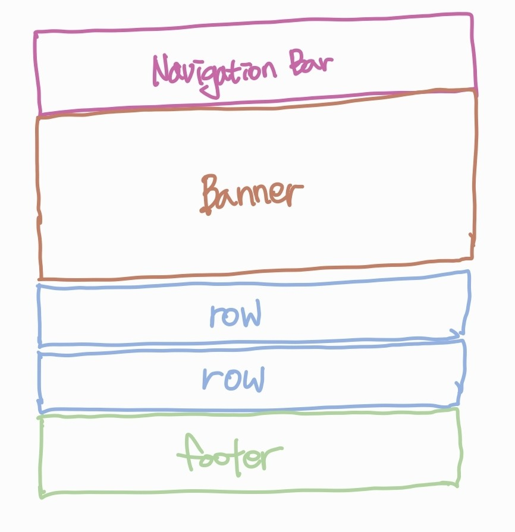

# 프로젝트 소개

> 인프런 '따라하며 배우는 리액트 A-Z'강의의 실습 내용입니다.

- [강의 바로가기](https://www.inflearn.com/course/%EB%94%B0%EB%9D%BC%ED%95%98%EB%8A%94-%EB%A6%AC%EC%95%A1%ED%8A%B8/dashboard)
- themovie db api 사용(API 키 생성 필요)

## 구조

### 컴포넌트 구조

{: width="300px"}

# 학습 정리
